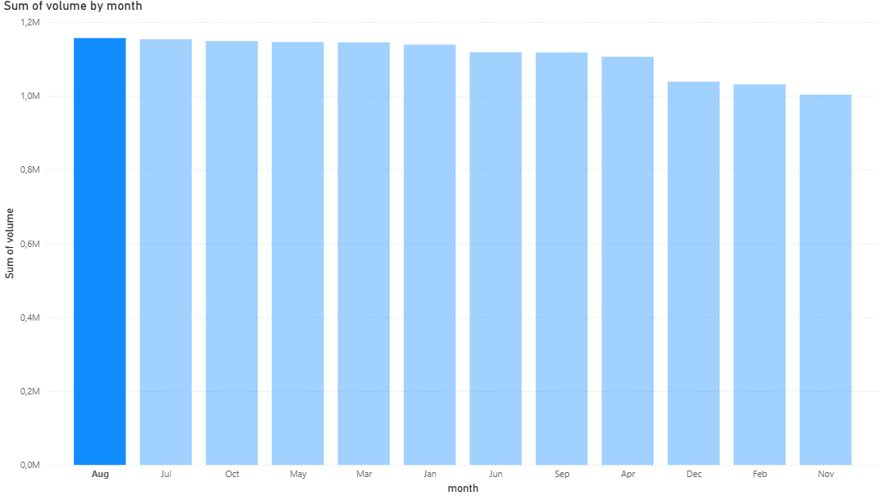
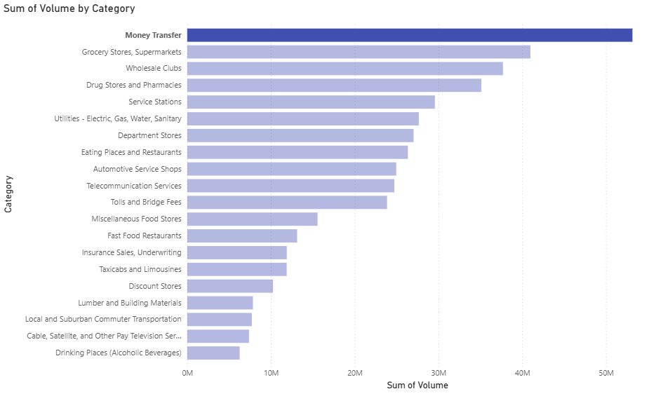
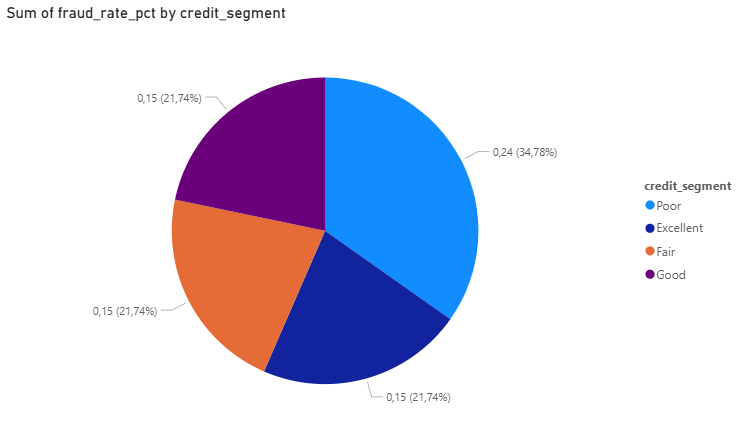
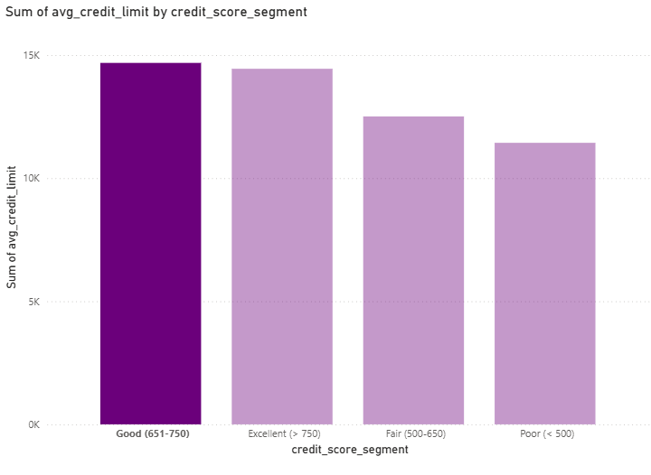
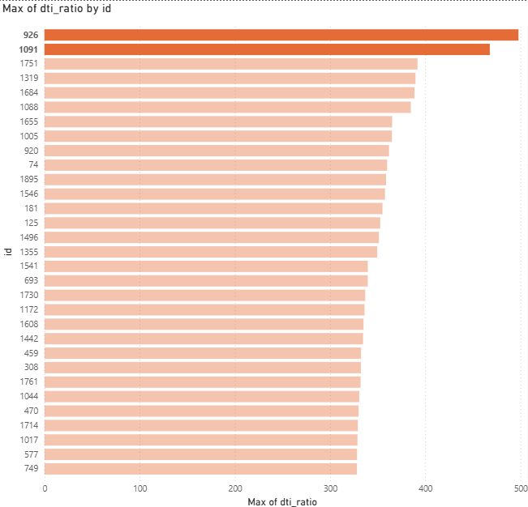
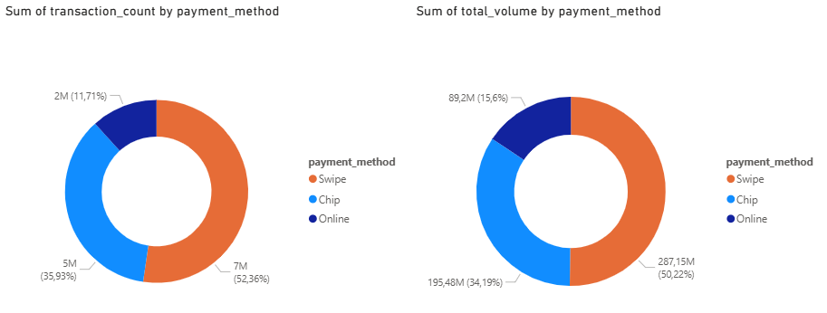
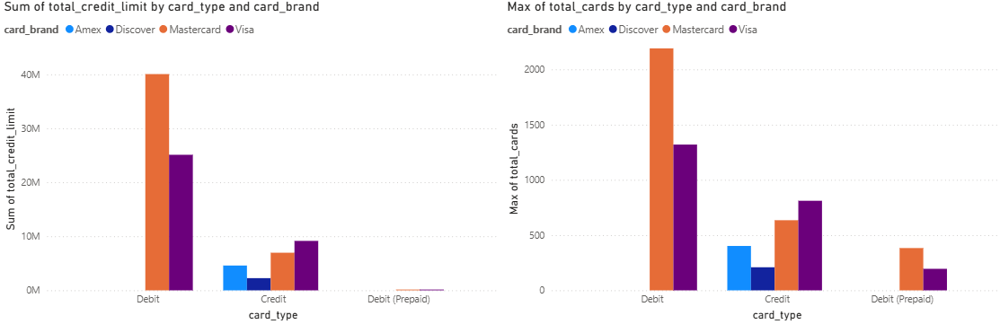
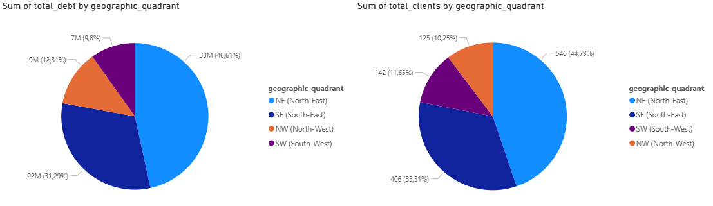
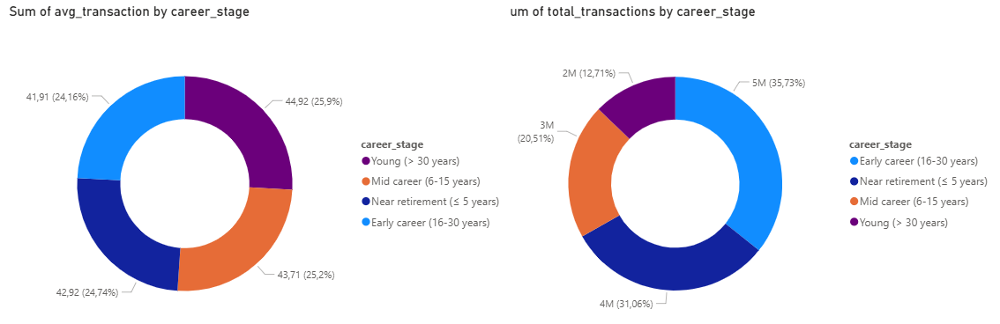
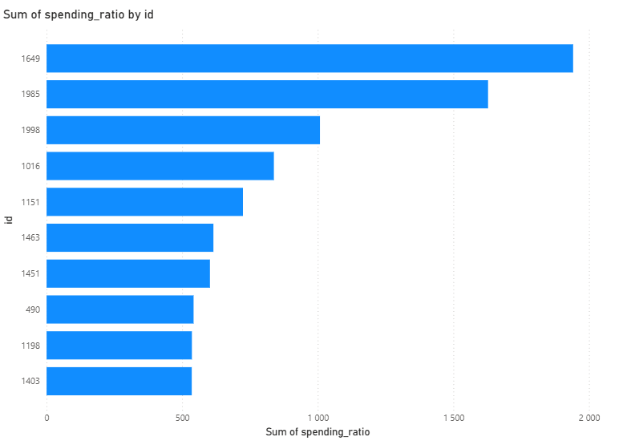

# 💳 Financial Transactions Analytics

A SQL portfolio project analyzing real-world banking data from a financial institution, covering customer behavior, fraud detection, credit risk, and payment patterns.

---

## 📌 Project Overview

This project explores a comprehensive financial dataset spanning the 2010s decade. The goal is to answer key business questions relevant to banking analytics — from identifying peak transaction periods to evaluating credit risk and fraud exposure.

The project demonstrates proficiency in advanced SQL techniques including **JOINs**, **CTEs**, **CASE WHEN**, **Window Functions**, and **type casting** on a real-world PostgreSQL database.

---

## 🗃️ Dataset

**Source:** [Kaggle — Financial Transactions Dataset (CaixaBank)](https://www.kaggle.com/datasets/computingvictor/transactions-fraud-datasets)

**Created by:** CaixaBank Tech for the 2024 AI Hackathon

**Size:** ~365 MB | Time period: 2010s decade

### Tables

| Table | Description |
|-------|-------------|
| `transactions_data` | Transaction records including amounts, dates, merchant info, and payment method |
| `users_data` | Customer demographics, income, debt, and credit score |
| `cards_data` | Card details including brand, type, and credit limits |
| `fraud_labels` | Binary fraud classification per transaction (Yes/No) |
| `mcc_codes` | Merchant Category Codes — maps MCC codes to business category names |

---

## ❓ Business Questions & Results

### Q1: Which month generates the highest transaction volume?
> Supports workforce planning and short-term staffing decisions during peak banking periods.



> 📊 Key finding: August generates the highest transaction volume, followed closely by July — indicating a summer peak that should inform seasonal staffing and operational planning decisions.

---

### Q2: Which merchant categories generate the highest total revenue? (TOP 20)
> Identifies key customer spending sectors to support product portfolio decisions and business partnerships.



---

### Q3: Does a lower credit score correlate with a higher fraud rate?
> Evaluates the effectiveness of credit score as a transaction risk indicator in the credit scoring process.



> 📊 Key finding: Customers with a Poor credit score (< 500) have a significantly higher fraud rate (24%) compared to other segments (~15%), confirming that credit score is an effective early indicator of transaction risk.

---

### Q4: Does credit score influence the assigned credit limit?
> Analyzes the bank's credit policy in the context of portfolio risk management.



> 📊 Key finding: A clear positive correlation exists between credit score and assigned credit limit — customers with Good/Excellent scores receive limits up to 28% higher than Poor-rated customers, reflecting a risk-based credit policy.

---

### Q5: Which 100 customers have the highest debt-to-income ratio?
> Identifies the TOP 100 high-risk customers for debt restructuring or collection actions.



> ⚠️ **Note:** Values on the X-axis represent the debt-to-income ratio (%). For example, a value of 497 means the customer's total debt is 497% of their annual income — indicating significant financial risk and potential inability to repay obligations.

---

### Q6: What is the share of each payment method (chip, swipe, online)?
> Supports infrastructure investment decisions based on customer payment preferences.



---

### Q7: What is the total credit limit by card brand and type?
> Analyzes card portfolio structure to assess risk exposure per brand.



---

### Q8: How is customer debt distributed across 4 US geographic regions?
> Identifies regional debt concentration for targeted risk management strategies.



> 📊 Key finding: The North-East region dominates both total debt (46.61%) and number of customers (44.79%), with proportional debt-per-client distribution across all regions — suggesting uniform lending practices nationwide.

---

### Q9: Does years until retirement influence average transaction amount?
> Behavioral segmentation by life stage supports personalized product offerings.



> 📊 Key finding: Average transaction amount is nearly identical across all career stages (~$42-45), suggesting that years until retirement has no significant influence on customer spending behavior in this dataset.

---

### Q10: What percentage of annual income did the TOP 10 customers spend on transactions in 2010?
> Identifies highest-spending customers relative to their income as a baseline for financial health assessment.



> ⚠️ **Note:** Values on the X-axis represent percentages (%) of annual income spent on transactions. For example, a value of 1941 means the customer spent 1941% of their yearly income — indicating significant use of credit or additional income sources beyond what is recorded in the dataset.

---

## 🛠️ Technologies

- **Database:** PostgreSQL 16
- **IDE:** DataGrip
- **Visualization:** Power BI Desktop
- **Data Conversion:** Python (JSON → CSV for fraud labels)

---

## 📁 Repository Structure

```
├── FT_console.sql               # All 10 SQL queries with comments
├── FT_Q1.csv ... FT_Q10.csv     # Query results exported from DataGrip
├── FT_Q1.png ... FT_Q10.png     # Power BI visualizations
├── README.md
├── LICENSE
└── .gitignore
```

---

## 🚀 How to Run

1. Download the dataset from [Kaggle](https://www.kaggle.com/datasets/computingvictor/transactions-fraud-datasets)
2. Convert `train_fraud_labels.json` to CSV using the following Python script:

```python
import json, csv

with open('train_fraud_labels.json', 'r') as f:
    data = json.load(f)

with open('fraud_labels.csv', 'w', newline='') as f:
    writer = csv.writer(f)
    writer.writerow(['transaction_id', 'fraud'])
    for transaction_id, label in data['target'].items():
        writer.writerow([transaction_id, label])
```

3. Import all CSV files into PostgreSQL using DataGrip
4. Run queries from `FT_console.sql`
5. Connect Power BI to PostgreSQL and build visualizations

---

## 👤 Author

**Jan Siczyński**
- GitHub: [Jan-Siczynski](https://github.com/Jan-Siczynski)
- LinkedIn: [jan-siczyński](https://www.linkedin.com/in/jan-siczyński-1b245a387/)
